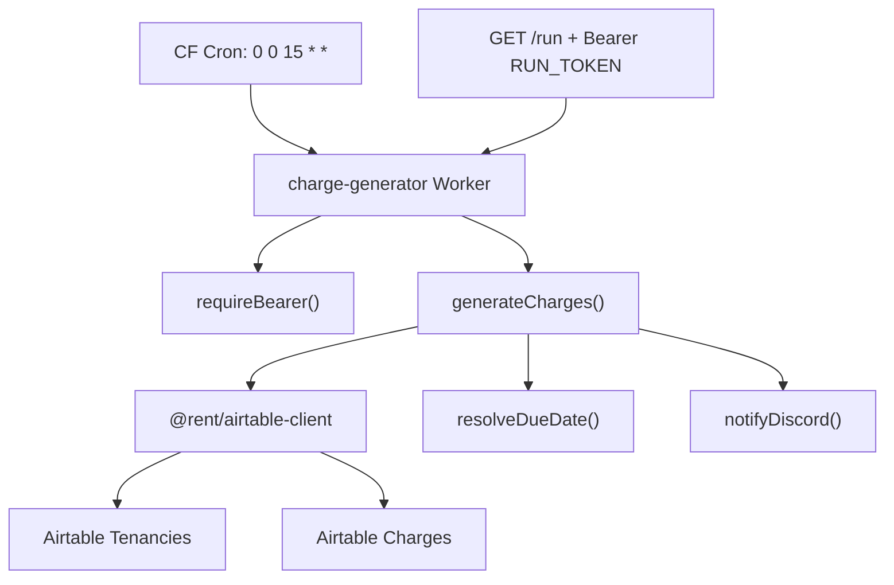

# charge-generator

Cloudflare Worker that creates monthly rent charge records in Airtable and notifies Discord.

## What It Does

Runs on the 15th of each month at midnight UTC and generates rent charges for the following month across all active tenancies. It is idempotent: if a charge already exists for a tenancy and period, that tenancy is skipped.

Manual `/run` requests are protected by a bearer token.

## Flow

```
Cron fires on the 15th
  -> Fetch active tenancies from Airtable
  -> Fetch existing Charges for next month's YYYY-MM period
  -> Skip already-covered tenancies
  -> Create missing Charge records
  -> Post Discord summary
  -> Log counts/errors to Cloudflare
```

## Architecture



## Airtable Schema

| Table | ID |
|---|---|
| Tenancies | `tblvVmo12VikITRH6` |
| Charges | `tblNCw6ZxspNxiKCu` |

Tenancy fields read: `Label`, `Monthly Rent`, `Start Date`, `End Date`, `Due Day`.

Charge fields written:

| Field | Value |
|---|---|
| `Label` | `{tenancy label} {YYYY-MM} Rent` |
| `Tenancy` | linked tenancy record ID |
| `Type` | `Rent` |
| `Period` | `YYYY-MM` |
| `Due Date` | `Due Day`, then `Start Date` day, capped at 28 |
| `Amount` | tenancy `Monthly Rent` |

## Environment Variables / Secrets

| Name | How to set | Description |
|---|---|---|
| `AIRTABLE_TOKEN` | `wrangler secret put AIRTABLE_TOKEN` | PAT with `data.records:read` and `data.records:write` |
| `AIRTABLE_BASE_ID` | `wrangler secret put AIRTABLE_BASE_ID` | Airtable base ID, for example `app6He8xRaUzNBTDl` |
| `DISCORD_WEBHOOK_URL` | `wrangler secret put DISCORD_WEBHOOK_URL` | Discord channel webhook URL |
| `RUN_TOKEN` | `wrangler secret put RUN_TOKEN` | High-entropy bearer token for `/run`; use `openssl rand -hex 32` |

## Setup

```bash
npm install
npx wrangler secret put AIRTABLE_TOKEN
npx wrangler secret put AIRTABLE_BASE_ID
npx wrangler secret put DISCORD_WEBHOOK_URL
npx wrangler secret put RUN_TOKEN
npm run deploy
```

## Commands

| Command | Purpose |
|---|---|
| `npm run dev` | Local dev with scheduled-test support |
| `npm run deploy` | Deploy to Cloudflare |
| `npm run cf-typegen` | Regenerate Worker binding types |
| `npm run typecheck` | Type-check this worker |
| `npm run build` | Wrangler deploy dry-run |

From the repo root:

```bash
npm run test -- charge-generator
```

## Manual Trigger

```bash
curl -H "Authorization: Bearer $RUN_TOKEN" \
  https://charge-generator.<your-subdomain>.workers.dev/run
```

Returns `Done — check Discord` on success and `401` when the bearer is missing, too short, or incorrect.

## Testing

Unit tests cover:

- `src/due-date.ts`
- `src/discord.ts`
- `src/auth.ts`

Integration tests run inside `@cloudflare/vitest-pool-workers` and cover:

- scheduled charge generation
- idempotency and skipped tenancies
- partial Airtable create failures
- Discord webhook failure being non-fatal
- Airtable read retry behavior
- `/run` bearer auth

Known test-tooling note: the current Workers Vitest pool dependency falls back to its bundled `workerd` compatibility date during tests. The production Wrangler dry-run still uses the worker's configured `compatibility_date`.

## Files

```
src/
  index.ts     -- Worker entrypoint and route/cron wiring
  charges.ts   -- charge-generation orchestration
  due-date.ts  -- due date resolver
  discord.ts   -- Discord summary notification
  auth.ts      -- /run bearer auth
test/
  *.test.ts
  integration/*.test.ts
wrangler.jsonc
tsconfig.json
```
