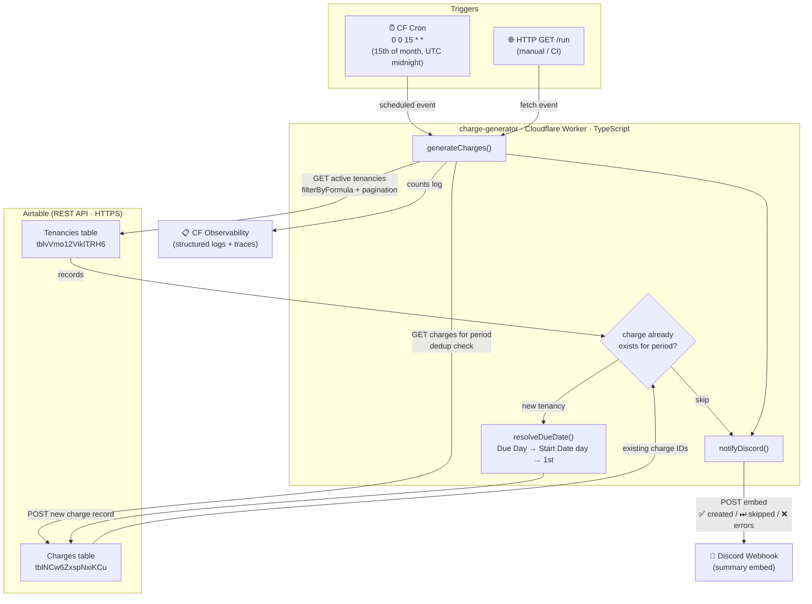

# charge-generator

Cloudflare Worker that automatically creates monthly rent charge records in Airtable and notifies Discord.

## Architecture



### Technology choices and why

| Layer | Technology | Why |
|---|---|---|
| **Runtime** | Cloudflare Workers | Serverless — no server to maintain; built-in cron scheduling; sub-millisecond cold starts; free tier covers monthly frequency |
| **Language** | TypeScript | Type safety for Airtable field shapes and env bindings; caught at deploy time, not runtime |
| **Airtable** | REST API (no SDK) | No external dependencies needed; the API is simple enough that a fetch wrapper is ~20 lines |
| **Notifications** | Discord webhook | Zero-dependency push notification to an existing channel; no bot token or infra required |
| **Observability** | CF built-in logs + traces | Native to the platform; zero config; survives without a separate logging service |

### Key design decisions and why

| Decision | Why |
|---|---|
| **Cron on 15th, charges for next month** | Gives tenants and the property manager ~2 weeks notice before the charge is due on the 1st; avoids generating charges too close to the due date |
| **Idempotency before creation** | Cron jobs can fire twice (CF edge retries); checking existing charges prevents duplicate billing |
| **Due Day field overrides Start Date day** | Some tenants negotiate a different payment day than their start date — the override field makes this explicit in Airtable without code changes |
| **28-day cap on due dates** | February has 28 days; capping prevents `2025-02-30` style invalid dates regardless of tenancy start day |
| **`buildQS` helper for `fields[]`** | Airtable requires bracket notation (`fields[]=Label&fields[]=Amount`); `URLSearchParams` alone doesn't produce this — the helper handles it cleanly |
| **Discord failure is non-fatal** | A broken webhook should not mask whether charges were actually created; `notifyDiscord` returns `bool`, errors are logged separately |

---

## What it does

Runs on the 15th of each month (UTC midnight) and generates rent charges for the **following** month across all active tenancies. Idempotent — safe to run multiple times, it skips charges that already exist for the target period.

### Flow

```
Cron fires (15th of month, 00:00 UTC)
  → Fetch all active tenancies from Airtable
      (End Date blank OR End Date >= today)
  → Fetch existing Charges for next month's period (YYYY-MM)
      (deduplication — skips already-covered tenancies)
  → For each uncovered tenancy:
      Resolve due date (Due Day field → Start Date day → 1st as fallback)
      POST new Charge record to Airtable
  → POST Discord embed with created / skipped / error summary
  → Log counts to Cloudflare dashboard
```

## Airtable schema

| Table | ID |
|---|---|
| Tenancies | `tblvVmo12VikITRH6` |
| Charges   | `tblNCw6ZxspNxiKCu` |

**Tenancy fields read:** `Label`, `Monthly Rent`, `Start Date`, `End Date`, `Due Day`

**Charge fields written:**

| Field | Value |
|---|---|
| Label | `{tenancy label} {YYYY-MM} Rent` |
| Tenancy | linked record ID |
| Type | `"Rent"` |
| Period | `YYYY-MM` |
| Due Date | resolved from `Due Day` or `Start Date` day (capped at 28) |
| Amount | tenancy's `Monthly Rent` |

## Environment variables / secrets

| Name | How to set | Description |
|---|---|---|
| `AIRTABLE_TOKEN` | `wrangler secret put AIRTABLE_TOKEN` | PAT with `data.records:read` + `data.records:write` |
| `AIRTABLE_BASE_ID` | `wrangler secret put AIRTABLE_BASE_ID` | Airtable base ID (e.g. `app6He8xRaUzNBTDl`) |
| `DISCORD_WEBHOOK_URL` | `wrangler secret put DISCORD_WEBHOOK_URL` | Discord channel webhook URL |

## Setup

```bash
npm install
wrangler secret put AIRTABLE_TOKEN
wrangler secret put AIRTABLE_BASE_ID
wrangler secret put DISCORD_WEBHOOK_URL
npm run deploy
```

## Commands

| Command | Purpose |
|---|---|
| `npm run dev` | Local dev with `--test-scheduled` flag |
| `npm run deploy` | Deploy to Cloudflare |
| `npm run cf-typegen` | Regenerate `worker-configuration.d.ts` from bindings |

## Manual trigger

Send a GET request to `/run` on the deployed worker URL:

```bash
curl https://charge-generator.<your-subdomain>.workers.dev/run
```

Returns `Done — check Discord` on success.

## Cron schedule

```
0 0 15 * *   — midnight UTC on the 15th of every month
```

Charges are generated for the **next** calendar month (so the 15th of April creates May charges).

## Due date logic

1. **`Due Day` field set** (1–28): use that day of the target month
2. **`Start Date` set**: use the same day-of-month, capped at 28
3. **Fallback**: 1st of the target month

The 28-day cap avoids invalid dates in February.

## Discord notification

Posts a colour-coded embed:
- 🟢 Green — charges created, no errors
- 🟡 Yellow — nothing to create (all already exist)
- 🔴 Red — at least one error

Fields: created list, skipped list, errors list.

## Files

```
src/
  index.ts    — Worker entry, generateCharges(), notifyDiscord()
  helper.ts   — buildQS() for Airtable's fields[] bracket notation
wrangler.jsonc
tsconfig.json
```
