# payment-bot

Cloudflare Worker running a Telegram bot for recording tenant rent payments into Airtable.

## Architecture

```mermaid
flowchart TD
    subgraph User["Operator (single authorised user)"]
        TG["📱 Telegram App"]
    end

    subgraph TelegramInfra["Telegram Infrastructure"]
        TGAPI["Telegram Bot API\n(api.telegram.org)"]
    end

    subgraph Worker["payment-bot · Cloudflare Worker · TypeScript"]
        direction TB
        AUTH["Auth guard middleware\n(AUTHORIZED_USER_ID check)"]
        GRAMMY["grammy webhook handler\nroutes commands + callbacks"]
        BOT["Bot logic\ncommands · callback queries · text router"]
        SESSION["KV session helpers\ngetSession / setSession / clearSession"]
    end

    subgraph Storage["Storage"]
        KV["☁️ Cloudflare KV\nSESSION_KV\nsession:{userId} · 1hr TTL"]
    end

    subgraph Airtable["Airtable (REST API · HTTPS)"]
        TEN["Tenancies\ntblvVmo12VikITRH6"]
        CHG["Charges\ntblNCw6ZxspNxiKCu"]
        PAY["Payments\ntbl8Zl9C9fzBDPllu"]
    end

    TG -->|"command / button tap"| TGAPI
    TGAPI -->|"HTTPS POST webhook\n(per message)"| AUTH
    AUTH -->|"authorised"| GRAMMY
    AUTH -->|"⛔ rejected"| TGAPI
    GRAMMY --> BOT
    BOT <-->|"read/write session\nbetween wizard steps"| SESSION
    SESSION <-->|"KV get/put/delete"| KV
    BOT -->|"GET active tenancies\nGET outstanding charges"| TEN
    BOT -->|"GET charges\n(filter client-side by tenancy)"| CHG
    TEN -->|"records"| BOT
    CHG -->|"records"| BOT
    BOT -->|"POST payment record\n(on confirm)"| PAY
    PAY -->|"new record ID\nfor Airtable deep-link"| BOT
    BOT -->|"editMessageText / reply\ninline keyboards"| TGAPI
    TGAPI -->|"message delivery"| TG
```



### Technology choices and why

| Layer | Technology | Why |
|---|---|---|
| **Runtime** | Cloudflare Workers | Stateless HTTPS endpoint that Telegram can push webhooks to; zero cold-start problem for interactive UX; no server to manage |
| **Language** | TypeScript | Wizard session shape (`WizardSession`) is complex multi-step state — types prevent accessing wrong fields at wrong steps |
| **Bot framework** | grammy | Only Telegram framework with first-class Cloudflare Workers support (`webhookCallback('cloudflare-mod')`); minimal bundle size; no Node.js APIs needed |
| **Session storage** | Cloudflare KV | Workers are stateless — in-memory state dies between requests; KV is the natural low-latency store in the CF ecosystem; TTL prevents abandoned sessions accumulating |
| **Communication** | Telegram webhook (not polling) | Polling requires a persistent process; webhooks fit the stateless Worker model perfectly — Telegram pushes each update as an HTTPS POST |
| **Data store** | Airtable | Source of truth for tenancies, charges, and payments; the property manager already views/edits data there; no separate database to maintain |

### Key design decisions and why

| Decision | Why |
|---|---|
| **Bot created fresh per request** | CF Workers have no shared memory between invocations; constructing the bot inside `fetch()` ensures no state leaks between users or requests |
| **Session in KV with 1hr TTL** | Multi-step wizard requires state that survives multiple Telegram messages; 1hr TTL auto-cleans abandoned sessions without a separate cleanup job |
| **Single `AUTHORIZED_USER_ID` guard** | This is a personal property management tool — adding multi-user auth would add complexity with no benefit; a middleware check on every request is the simplest safe approach |
| **Client-side charge filtering by tenancy** | Airtable formula filters on linked record fields match against the primary field *value*, not the record ID — fragile when tenant names contain special characters; pulling all unpaid charges and filtering in JS is reliable |
| **Inline keyboards for selection, text for amounts/dates** | Buttons prevent typos for enumerable choices (tenants, charges, methods, dates); free-text is unavoidable for amounts and custom dates — this minimises input errors |
| **`editMessageText` for wizard progression** | Updates the same message rather than sending new ones — keeps the Telegram chat clean; a single card per wizard run instead of a growing message chain |
| **Payment label `{name} {date} {amount}`** | Human-readable in Airtable; accidental duplicate payments become immediately visible without querying |
| **Airtable deep-link in confirmation** | Returns a direct URL to the new Payments record so the operator can verify or edit immediately without navigating Airtable manually |

---

## What it does

A single-user Telegram bot that guides an authorized user through a 6-step wizard to log a payment against an outstanding charge. Session state persists in Cloudflare KV with a 1-hour TTL (stale wizards auto-expire). The payment record is created in Airtable and a direct link is returned.

### Wizard flow

```
/pay
  → Step 1: Select tenant        inline keyboard — shows balance per tenancy (🔴 = owes money, ✅ = clear)
  → Step 2: Select charge        inline keyboard — shows outstanding amount (🔴 Overdue / 🟡 Partial / 🟠 Unpaid)
  → Step 3: Enter amount         text reply — accepts 1650, $1,650, 1650.00
  → Step 4: Select method        buttons: Cash | Bank Transfer
  → Step 5: Select date          buttons: Today | Yesterday | Enter manually (YYYY-MM-DD or DD/MM/YYYY)
  → Step 6: Confirm              summary card with Confirm ✅ / Cancel ❌ buttons
  → Payment record created in Airtable with link
```

## Airtable schema

| Table | ID |
|---|---|
| Tenancies | `tblvVmo12VikITRH6` |
| Charges   | `tblNCw6ZxspNxiKCu` |
| Payments  | `tbl8Zl9C9fzBDPllu` |

**Tenancy fields read:** `Label`, `Balance`, `End Date`

**Charge fields read:** `Label`, `Balance`, `Status`, `Due Date`, `Tenancy`

**Payment fields written:**

| Field | Value |
|---|---|
| Label | `{tenant name} {YYYY-MM-DD} ${amount}` |
| Charge | linked record ID |
| Amount | entered amount |
| Paid Date | selected date |
| Method | `"Cash"` or `"Bank Transfer"` |
| Notes | `Recorded via payment-bot on {datetime}` |

## Environment

### Secrets (set via `wrangler secret put`)

| Name | Description |
|---|---|
| `TELEGRAM_BOT_TOKEN` | From @BotFather |
| `AIRTABLE_TOKEN` | PAT with `data.records:read` + `data.records:write` |
| `AUTHORIZED_USER_ID` | Your Telegram numeric user ID (get from @userinfobot) |

### Vars (in `wrangler.toml`)

| Name | Value |
|---|---|
| `AIRTABLE_BASE_ID` | `app6He8xRaUzNBTDl` |

### KV namespace

| Binding | Purpose |
|---|---|
| `SESSION_KV` | Wizard session state, 1hr TTL per user |

## Setup

### 1 — Create KV namespace

```bash
wrangler kv namespace create SESSION_KV
```

Copy the returned `id` into `wrangler.toml` → `[[kv_namespaces]]`.

### 2 — Set secrets

```bash
wrangler secret put TELEGRAM_BOT_TOKEN
wrangler secret put AIRTABLE_TOKEN
wrangler secret put AUTHORIZED_USER_ID
```

### 3 — Deploy

```bash
npm install
npm run deploy
```

Note your Worker URL: `https://payment-bot.<your-subdomain>.workers.dev`

### 4 — Register Telegram webhook

Run once after deploy:

```bash
curl "https://api.telegram.org/bot<YOUR_BOT_TOKEN>/setWebhook" \
  -d "url=https://payment-bot.<your-subdomain>.workers.dev"
```

Expected response: `{"ok":true,"result":true,"description":"Webhook was set"}`

Verify:

```bash
curl "https://api.telegram.org/bot<YOUR_BOT_TOKEN>/getWebhookInfo"
```

### 5 — Test

Open Telegram, find your bot, send `/help`.

## Commands

| Bot command | Action |
|---|---|
| `/pay` | Start payment wizard |
| `/cancel` | Cancel wizard from any step |
| `/help` or `/start` | Show command list |

## Development commands

| npm script | Purpose |
|---|---|
| `npm run dev` | Local dev (wrangler dev) |
| `npm run deploy` | Deploy to Cloudflare |
| `npm run types` | Regenerate TS types from wrangler bindings |

## Files

```
src/
  index.ts     — Worker entry: creates bot per request, calls webhookCallback
  bot.ts       — grammy bot: all commands, callback handlers, wizard steps
  airtable.ts  — Airtable REST helpers: fetchAllRecords, createRecord, buildQS
  types.ts     — Env, WizardSession, AirtableRecord types
wrangler.toml
tsconfig.json
```

## Architecture notes

- **Stateless per request**: bot is created fresh on every Cloudflare Workers invocation; no in-memory state
- **Session in KV**: `session:{userId}` key, JSON-serialized `WizardSession`, 1hr TTL
- **Auth guard**: middleware rejects any Telegram user whose ID doesn't match `AUTHORIZED_USER_ID`
- **Client-side charge filtering**: charges are filtered by tenancy ID in JS rather than via Airtable formula, because formula filtering on linked record fields compares primary field values (fragile with special characters)
- **Idempotent label**: payment label format `{name} {date} {amount}` makes accidental duplicates visible in Airtable
