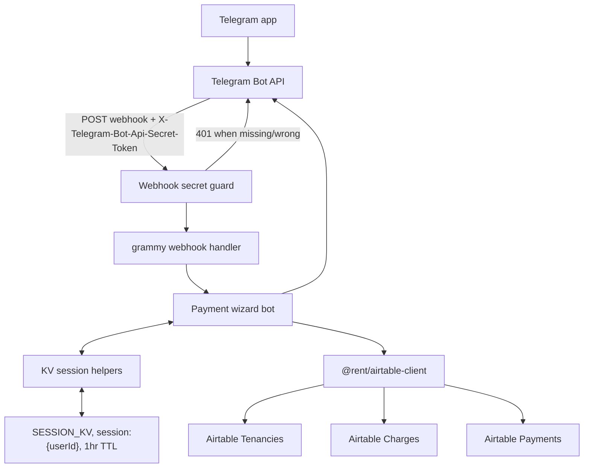

# payment-bot

Cloudflare Worker running a single-operator Telegram bot for recording tenant rent payments into Airtable.

## Architecture



### Technology choices

| Layer | Technology | Why |
|---|---|---|
| Runtime | Cloudflare Workers | Stateless HTTPS endpoint for Telegram webhooks |
| Bot framework | grammy | First-class Cloudflare Workers webhook support |
| Session storage | Cloudflare KV | Wizard state survives between webhook requests and expires automatically |
| Airtable I/O | `@rent/airtable-client` | Shared table IDs, Zod schemas, pagination, retries, and timeouts |
| Auth | `AUTHORIZED_USER_ID` plus `TELEGRAM_WEBHOOK_SECRET` | The bot is single-operator, and Telegram webhook POSTs must carry the configured secret token |

## What It Does

The bot guides the authorized user through a 6-step wizard to log a payment against an outstanding charge. Session state persists in Cloudflare KV with a 1-hour TTL. The final Payment record is created in Airtable and the bot replies with a direct Airtable link.

### Wizard Flow

```text
/pay
  -> Step 1: Select tenant        inline keyboard, shows balance per tenancy
  -> Step 2: Select charge        inline keyboard, shows outstanding amount/status
  -> Step 3: Enter amount         text reply, accepts 1650, $1,650, 1650.00
  -> Step 4: Select method        Cash | Bank Transfer
  -> Step 5: Select date          Today | Yesterday | manual date
  -> Step 6: Confirm              summary with Confirm / Cancel buttons
  -> Payment record created in Airtable
```

## Airtable Schema

| Table | ID |
|---|---|
| Tenancies | `tblvVmo12VikITRH6` |
| Charges | `tblNCw6ZxspNxiKCu` |
| Payments | `tbl8Zl9C9fzBDPllu` |

The Worker uses `@rent/airtable-client` schemas:

| Schema | Used for |
|---|---|
| `TenancySchema` | Reading `Label`, `Balance`, `End Date` |
| `ChargeSchema` | Reading `Label`, `Balance`, `Status`, `Due Date`, `Tenancy` |
| `PaymentSchema` | Validating Payment create responses |

Payment fields written:

| Field | Value |
|---|---|
| `Label` | `{tenant name} {YYYY-MM-DD} ${amount}` |
| `Charge` | linked charge record ID |
| `Amount` | entered amount |
| `Paid Date` | selected date |
| `Method` | `Cash` or `Bank Transfer` |
| `Notes` | `Recorded via payment-bot on {datetime}` |

## Environment

### Secrets

Set with `npx wrangler secret put <NAME>` from `payment-worker/`.

| Name | Description |
|---|---|
| `TELEGRAM_BOT_TOKEN` | From @BotFather |
| `TELEGRAM_WEBHOOK_SECRET` | High-entropy secret, at least 16 chars; use `openssl rand -hex 32` |
| `AIRTABLE_TOKEN` | PAT with `data.records:read` and `data.records:write` |
| `AUTHORIZED_USER_ID` | Telegram numeric user ID for the single authorized operator |

### Vars

| Name | Value |
|---|---|
| `AIRTABLE_BASE_ID` | `app6He8xRaUzNBTDl` |

### KV Namespace

| Binding | Purpose |
|---|---|
| `SESSION_KV` | Wizard session state, 1hr TTL per user |

## Setup

### 1. Create KV Namespace

```bash
npx wrangler kv namespace create SESSION_KV
```

Copy the returned `id` into `wrangler.toml` under `[[kv_namespaces]]`.

### 2. Set Secrets

```bash
npx wrangler secret put TELEGRAM_BOT_TOKEN
npx wrangler secret put TELEGRAM_WEBHOOK_SECRET
npx wrangler secret put AIRTABLE_TOKEN
npx wrangler secret put AUTHORIZED_USER_ID
```

### 3. Deploy

```bash
npm install
npm run deploy
```

Note the Worker URL, for example `https://payment-bot.<your-subdomain>.workers.dev`.

### 4. Register Telegram Webhook

Run once after deploy, and again whenever `TELEGRAM_WEBHOOK_SECRET` is rotated:

```bash
curl "https://api.telegram.org/bot<YOUR_BOT_TOKEN>/setWebhook" \
  -d "url=https://payment-bot.<your-subdomain>.workers.dev" \
  -d "secret_token=<TELEGRAM_WEBHOOK_SECRET>"
```

Telegram should return:

```json
{"ok":true,"result":true,"description":"Webhook was set"}
```

Telegram then sends `X-Telegram-Bot-Api-Secret-Token: <TELEGRAM_WEBHOOK_SECRET>` on every webhook POST. The Worker rejects POSTs without the matching header.

Verify registration:

```bash
curl "https://api.telegram.org/bot<YOUR_BOT_TOKEN>/getWebhookInfo"
```

### 5. Smoke Test

Open Telegram, find the bot, and send `/help`.

## Commands

| Bot command | Action |
|---|---|
| `/pay` | Start payment wizard |
| `/cancel` | Cancel wizard from any step |
| `/help` or `/start` | Show command list |

## Development Commands

| Command | Purpose |
|---|---|
| `npm run dev` | Local dev with Wrangler |
| `npm run deploy` | Deploy to Cloudflare |
| `npm run types` | Regenerate Worker binding types |
| `npm run typecheck` | Type-check this worker |
| `npm run build` | Wrangler deploy dry-run |

From the repo root:

```bash
npm run typecheck
npm run test -- payment-worker
npm run build
```

## Testing

Test coverage includes:

| Layer | Files | Coverage |
|---|---|---|
| Unit | `test/format.test.ts` | amount/date parsing and AUD formatting |
| Unit | `test/session.test.ts` | KV session get/set/clear and TTL |
| Unit | `test/auth.test.ts` | webhook secret fail-closed behavior |
| Integration | `test/integration/webhook.test.ts` | GET banner and webhook secret rejection |
| Integration | `test/integration/wizard.test.ts` | full wizard path, invalid amount, cancel, and Payment payload |

Run from the repo root:

```bash
npm run test
npm run test -- payment-worker
```

Integration tests run inside `@cloudflare/vitest-pool-workers` with Telegram and Airtable HTTP calls mocked. Tests must not hit the real Airtable API.

## Expected Phase 4 File Layout

```text
src/
  index.ts      -- Worker entrypoint, GET banner, Telegram secret guard, webhook handler
  bot.ts        -- grammy bot commands, callbacks, and wizard steps
  format.ts     -- amount/date parsing and display formatting
  session.ts    -- KV session helpers
  auth.ts       -- Telegram webhook secret guard
  types.ts      -- Env and WizardSession types
test/
  auth.test.ts
  format.test.ts
  session.test.ts
  integration/
    webhook.test.ts
    wizard.test.ts
vitest.config.ts
vitest.integration.config.ts
wrangler.toml
tsconfig.json
```

`payment-worker/src/airtable.ts` has been removed; Airtable I/O belongs in `@rent/airtable-client`.

## Operational Notes

- Non-POST requests return a lightweight "payment-bot is running" banner for health checks.
- POST requests fail closed with `401` when `TELEGRAM_WEBHOOK_SECRET` is missing, shorter than 16 characters, or does not match Telegram's header.
- grammy user authorization still happens inside the bot and rejects Telegram users whose ID does not match `AUTHORIZED_USER_ID`.
- Sessions use the `session:{userId}` KV key and a 3600 second TTL.
- Client-side charge filtering by tenancy ID remains intentional because Airtable formula filters on linked-record display values are fragile.
